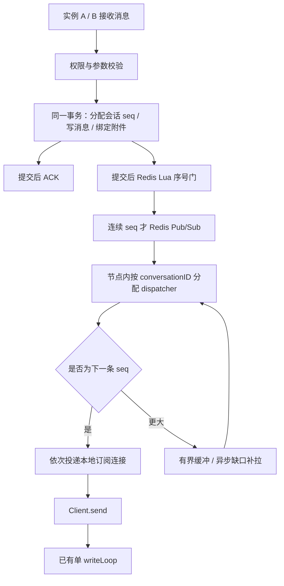

# 会话序号与 CSP 有序投递设计

状态：已实现并完成双实例压测。适用当前 Go/Gin/PostgreSQL/Redis 双实例项目。

## 决策与保证范围

采用「事务内会话序号 + Redis Lua 序号门 + 节点内 CSP 调度 + 缺口恢复 + 客户端连续游标」。保持 Redis Pub/Sub 实时传输，不增加新的中间件。

目标是：对一个连接订阅的同一会话，自同步起点之后的聊天消息按服务端 `seq` 递增进入 `Client.send`；客户端在重连、重复与丢失场景下按连续游标恢复。不同会话没有全局顺序约束。并发发送的先后由服务端事务序列确定，不承诺还原不同设备的墙上时钟时间。ACK 表示消息已提交，不表示对端已经收到，不参与聊天消息顺序比较。

这不保证 Redis 原始事件到达有序，不保证故障期间低延迟，也不保证一个无限热点会话能够无限扩容。发生缺口时后面的消息必须等待恢复，或显式进入重新同步，不能跳过缺口仍声称严格有序。

## 为什么适合当前阶段

Docker 实测中，100 连接 × 20 条/秒持续约一分钟，12 万条均到达，对端 P99 94.28 ms；200 连接 × 20 条/秒短测 P99 约 4 秒，消息处理已积压。1000 连接 × 1 条/秒的同步突发场景虽收齐，P99 约 19.4 秒。详见 [报告](../../loadtest/DOCKER_RESULTS.md)。

当前应避免为保序引入全局锁、每条消息新建 goroutine，或把一大组会话的数据库操作串行化。长期可以采用会话固定归属的 actor 架构，但跨实例 owner 需要路由、租约、隔离旧 owner 和故障接管，超出当前保序修复所需范围。

数据库事务只负责分配权威 seq 和写入消息；提交后的正常发布由 Redis Lua 原子完成。Lua 按会话把先到的较大 seq 暂存在 hash，只在缺口补齐时连续 PUBLISH，因此跨实例不会把 `seq=2` 发布在 `seq=1` 前。节点内内存调度限定在各实例内部。每次首次写入仍有会话计数器更新和唯一索引维护，同一热点会话存在行锁争用。

## 链路



## 1. PostgreSQL 确定权威序号

字段与索引：

- `conversations.last_seq BIGINT NOT NULL DEFAULT 0`
- `messages.seq BIGINT NOT NULL`
- 唯一约束 `(conversation_id, seq)`
- 保留 `(sender_id, client_msg_id)` 幂等约束和全局消息主键。

在同一个短事务中执行：

```sql
UPDATE conversations
SET last_seq = last_seq + 1
WHERE id = $1
RETURNING last_seq;
-- 用返回的 seq 插入消息；附件绑定也在此事务。
-- 成功后 COMMIT；任意步骤失败则 ROLLBACK。
```

同一会话并发更新同一行，竞争事务等待前一个事务结束；不同会话分别锁定自己的行。计数器是普通事务字段，不使用 PostgreSQL sequence/nextval 或独立 Redis INCR；事务回滚同时撤销计数器更新，因此正常写入失败不制造已提交序列的空洞。

Redis 发布不放在事务里，网络抖动不能延长序号行锁占用。重复请求返回原消息和原 seq，不消耗新序号；热路径先尝试插入，命中 `(sender_id, client_msg_id)` 唯一约束才读取已有记录，避免每条新消息额外做一次幂等查询。复用同一 clientMsgID 但目标/正文不同应拒绝，不能作为正常幂等成功。

历史消息可在维护窗口按每会话原消息 ID 排序回填 seq，初始化 last_seq。回填过程禁止并发新写，或另行设计在线迁移；新增 migration，不修改已有 migration。消息删除以后保留序号对应的删除事件/占位信息，避免合法删除变成无法补齐的缺口。

## 2. 每条消息只发布一个规范化事件

controller 只发布一次事件，包含 `conversationID / seq / publishBaseSeq / messageID / senderID / targetType / content / 接收范围`，由目标实例为连接生成接收者视角的 targetID。`publishBaseSeq` 是该事务开始时数据库已确认的水位，Redis 门在 key 因重启或过期消失时用它重建期待序号。

发送方回显和接收方聊天消息均经过同一个 dispatcher；ACK、心跳和明确不属于聊天序列的控制消息不强行阻塞。Redis 失败时的本地降级也必须进入 dispatcher，不得直接绕过保序调用 Hub。

正常路径调用一次 Lua 脚本：`HSET` 暂存、连续 `PUBLISH`、推进 Redis 水位。Lua 返回实际放行水位，由进程内 100 ms 合并器异步写回 `last_published_seq`；进程在合并前崩溃时恢复任务会少量重发，CSP dispatcher 按 seq 去重。权限和成员视图必须有明确的一致性规则；用户退出/移除后的投递不能依赖无限期失效的缓存。

## 3. 有界 CSP dispatcher，正常路径直接入队

实现使用 16 个固定分区，每个分区一个 goroutine，`hash(conversationID) % partitions` 决定归属。这个哈希只用于进程内调度，不能当作跨实例 owner。

每个活跃会话维护：下一期待序号、待处理事件、恢复状态、本地订阅连接集合。所有状态修改由所属 dispatcher 串行完成，无需会话状态的大范围互斥锁。

- `seq < next`：识别为重复/迟到；不能重复向已推进的连接投递。
- `seq == next`：立即向本地连接入队，并释放缓冲中的连续消息；不经过固定等待窗口。
- `seq > next`：暂存并触发合并后的缺口恢复。补拉期间 dispatcher 继续处理其他会话。

每次循环限制释放消息/投递任务的工作量，避免一个热点会话长期占用分区。将恢复查询交给固定大小的 I/O worker 池，结果作为事件返回 dispatcher，带同步代次，丢弃过时查询结果。相同会话只允许一个恢复任务在途。

初始调参范围（不是已验证最佳值）：

- 每会话最多缓存 128 条或 256 KiB，以先达到者为准；实例总缓冲设置独立字节上限，例如 32 MiB。
- 缺口合并等待 5–10 ms 后异步查询；只影响缺口，不影响按序消息。可根据实际恢复查询率调节。
- dispatcher 的输入 channel、I/O 任务队列均有界。队列满不能阻塞整个 Redis 消费循环无限等待，也不能静默丢弃后假装同步成功；对应会话进入重新同步，必要时关闭连接让客户端恢复。
- 同步失败/等待超限时显式重新同步或断开，不允许越过缺口直接继续展示。

`Hub.SendToMany` 第一版仍同步完成各连接入队；每连接已有独立 `writeLoop` 并行写网络。后续大群 profile 若证明扇出是瓶颈，再按 connectionID 建立固定投递 worker；同一连接的任务必须始终走同一路径，不能每条消息随机启动 goroutine。

## 4. 订阅起点与每连接游标

不能在 Redis 之前用“第一条到达事件的 seq”初始化全局顺序：若 12 先到，会错过 11。当前 Redis 序号门已经保证一个订阅存活期内不会把 12 发布在 11 前；节点 dispatcher 因而可把订阅后的第一条作为实时基线。新连接、旧连接和重连客户端的历史位置仍然不同，不能只维护一个实例级游标。

每个会话共享一次实时整序状态，但每个连接维护独立同步阶段和已入队游标。建立订阅时：

1. 在 dispatcher 中登记连接为 syncing，并暂存该会话后续实时事件。
2. 从数据库取得已提交的水位 H，按授权范围补齐客户端连续游标之后到 H 的记录，或完成明确的初始快照同步。
3. 同一条串行投递路径依次发送快照/补拉记录；确认同步边界，再释放 H 之后的连续实时消息。
4. 过渡期间的重复事件按 seq 去重。补拉某个连接的历史不能重新广播给已同步的所有连接。

首次无本地历史可以用“最近一页 + 明确的同步基线”建立状态，而不是声称拥有从 1 开始的全部历史。群聊加入/退出/权限变化必须定义可见起点和有效接收范围；如果某些序号不可见，应传递明确的可见范围/跳过边界，不能把无权限读取的消息当作无限等待的缺口。

连接建立和会话切换都需要此类交接协议，不能仅让前端发一次 REST 查询，然后不加协调地接入实时流。

## 5. 恢复必须覆盖“没有后续消息”的情况

Pub/Sub 是 at-most-once，末尾一条丢失后可能再无更大的 seq 来暴露缺口。因此不能只实现 `seq > next` 时补拉：

- Redis 重新订阅后，批量检查当前本地活跃会话水位并恢复。
- 周期性批量对账活跃会话的数据库 last_seq，例如可配置 3–5 秒一个周期并打散任务；不是每消息或每连接独立查询。
- 新消息发布失败时触发本地恢复信号；其他实例依赖对账发现未推送的已提交消息。
- ACK 丢失后的同 clientMsgID 重试不生成新 seq；仍由恢复机制保证已有消息可达。

这允许保留 Pub/Sub 作为低延迟通知，而不依赖它保存消息。故障期间恢复延迟受对账周期和数据库可用性影响，不能承诺与正常路径相同。

## 6. 客户端与查询接口一起切换

推送、ACK、REST 消息返回都携带会话 seq。历史分页、增量补拉、已读位置、未读数计算和最后一条消息查询使用会话 seq；全局 messageID 留作标识和兼容用途。

前端必须记录“最后连续应用的 seq”，不能拿最大收到的序号直接推进游标；补拉要循环分页到同步水位，修复现有重连补拉只读一页 100 条的限制。同一批消息合并后批量渲染，避免每条消息都重排整段历史。

浏览器端仍保留去重和缺口恢复，服务端顺序控制不替代端到端同步。

## 7. 并发和延迟的配套工作

实现后持续测量，避免再混合无关优化而无法归因：

- 观测事务耗时、会话行锁等待、数据库连接池等待、Redis 发布耗时、dispatcher 排队时间和缺口恢复次数。
- 减少解析会话、读取成员等重复查询；可以采用有上限的缓存及请求合并，但需要成员变更的失效与权限校验，不能用长 TTL 代替授权一致性。
- 正常幂等查询未命中不作为高频错误日志输出；保留真实 SQL/业务错误日志。
- 发送规范化事件时尽量一次编码/一次发布，目标视角数据在节点侧生成。
- 优先保留私聊的小范围同步入队；不在没有 profile 证据时增加投递 goroutine。
- PostgreSQL 的 `COMMIT` 等待 WAL fsync 时，优先检查数据库磁盘延迟、Docker/虚拟化卷与连接池，而不是把 Redis 序号门当作瓶颈。当前配置可选 `database.message_async_commit=true`，仅对聊天事务执行 `SET LOCAL synchronous_commit = 'off'`；它降低慢盘尾延迟，但主机断电可能丢失极少量已 ACK 消息，默认必须保持关闭。

## 8. 验收

正确性测试：

- 两实例双向并发、同用户多连接发送；比较同一连接同一会话的 seq，而非跨会话全局 ID。
- 人为延迟较小 seq 的发布，验证严格按连续序号进入 Client.send。
- 事务失败、并发幂等重试、进程在提交后发布前退出。
- Redis 订阅重连、只丢最后一条且之后无新消息、断线后超过 100 条待补消息。
- 订阅登记/快照/实时事件交错、群成员变更、慢连接与窗口溢出。
- 区分原始 Redis 到达乱序、Client.send 输出乱序和客户端最终应用乱序；不得以前端排序掩盖输出乱序。

性能测试：复用 Docker 20–1000 连接矩阵，分别跑同步突发和打散发送时间的负载；保留相同数据库状态、资源配置和消息尺寸。重复至少 3 轮，增加热群扇出与单热点会话场景。比较有效对端到达吞吐、ACK/P99、队列深度、缺失与重复数量，不能只看 socket 写成功数。

候选验收目标：100 连接、2000 条/秒持续至少 60 秒，消息按会话 seq 有序、无窗口内缺失；P99 尽量接近现有约 94 ms 基线。具体阈值应在重复基线后确定；不在实现前承诺千连接低延迟或吞吐提升。

## 公开资料

- [Discord 的分区消息投递](https://discord.com/blog/how-discord-scaled-elixir-to-5-000-000-concurrent-users)：稳定接收者分区，避免每次广播创建独立进程打乱事件顺序。
- [Telegram 更新恢复协议](https://core.telegram.org/api/updates)：客户端序列状态与缺口恢复；不等同于本项目简化的会话 seq。
- [PostgreSQL 行锁](https://www.postgresql.org/docs/17/explicit-locking.html)：同一行的冲突更新由事务锁协调。
- [Redis Pub/Sub](https://redis.io/docs/latest/develop/pubsub/)：at-most-once，需要在其他层提供完整性恢复。
